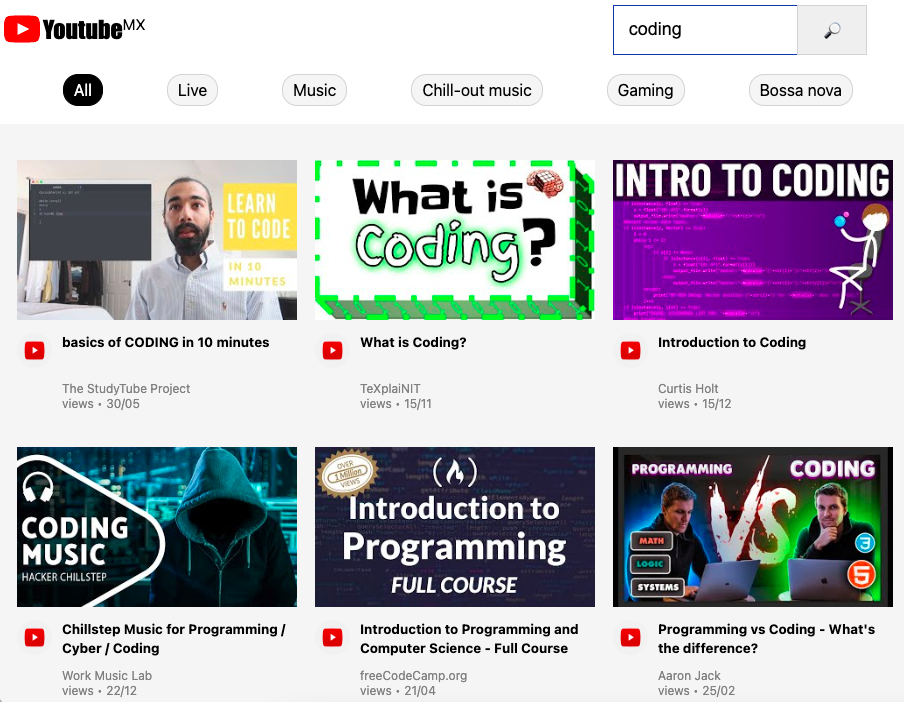

# Youtube API Search Replica
<h3>What is it?</h3>

A replication of <a href="https://www.youtube.com/" target="_blank">Youtube's</a> search function with real data.

<h3>Purpose</h3>

This project helped me to combine my html/css with my javascript skills by using real data from the Youtube API to recreate the search function.

Download this repo and try yourself! You can search for your favorite videos and access them.

<h3>Screenshot</h3>

